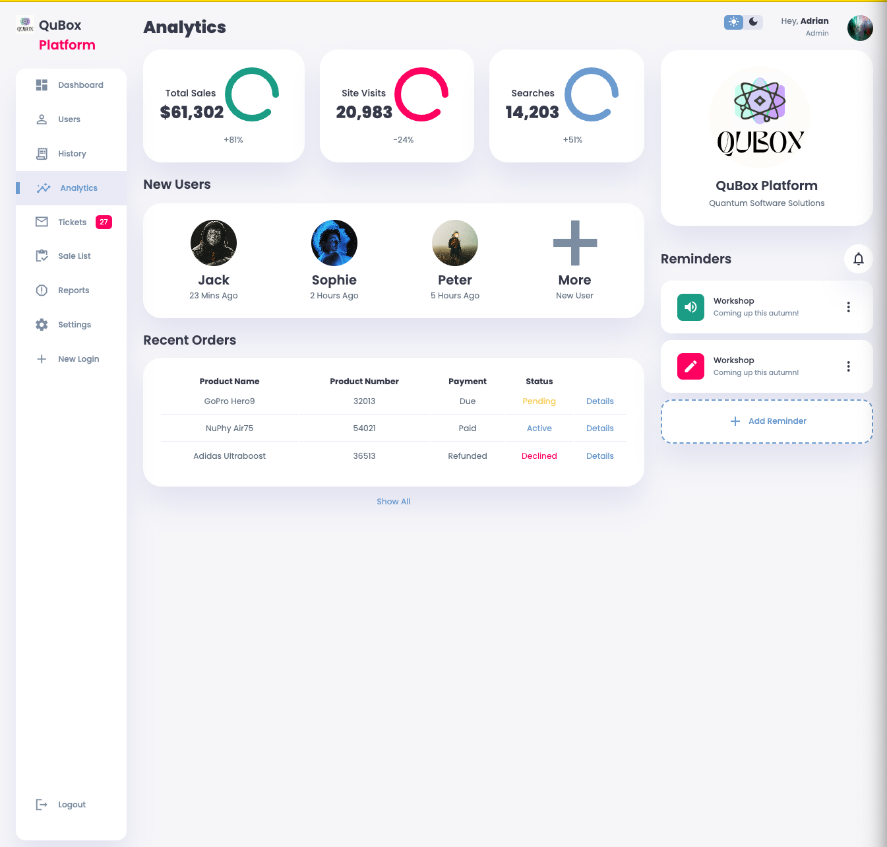
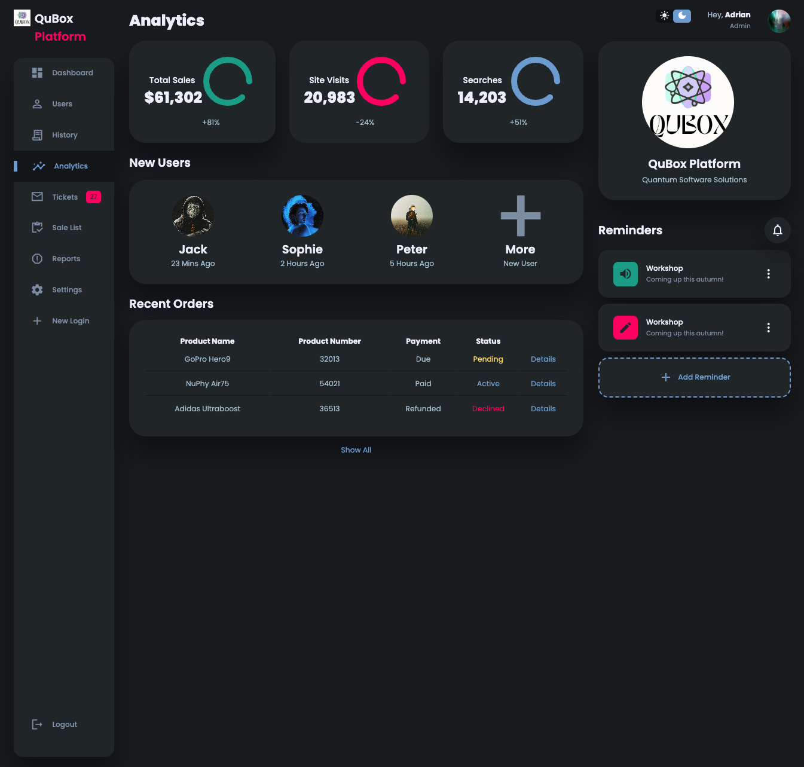
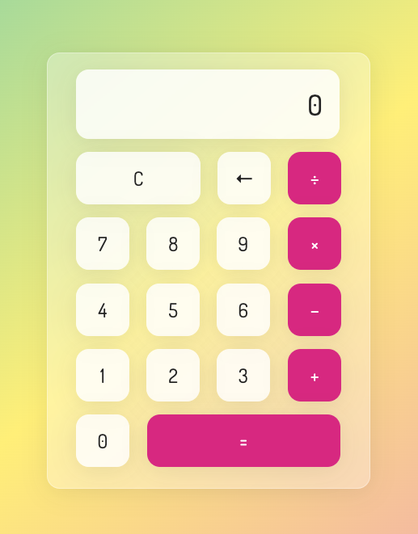
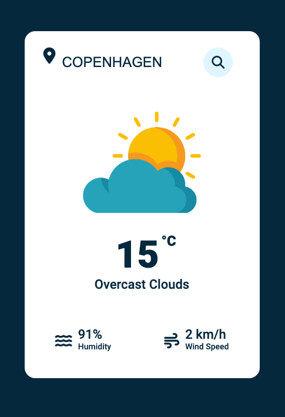

# Vanilla Front-end Projects

Repository for various front-end challenges and basic applications written in vanilla HTML &amp; CSS &amp; JS.

--------------

* Dynamic &amp; Interactive particle background - Main Portfolio Page

* Analytics Dashboard with dark-light mode toggle:

    

* Calculator application:

    

* Weather application connected to API for live location queries:

        Requires API Key generated and declared in a config file.

    

* Product preview card for mobile &amp; desktop web-pages:

    
