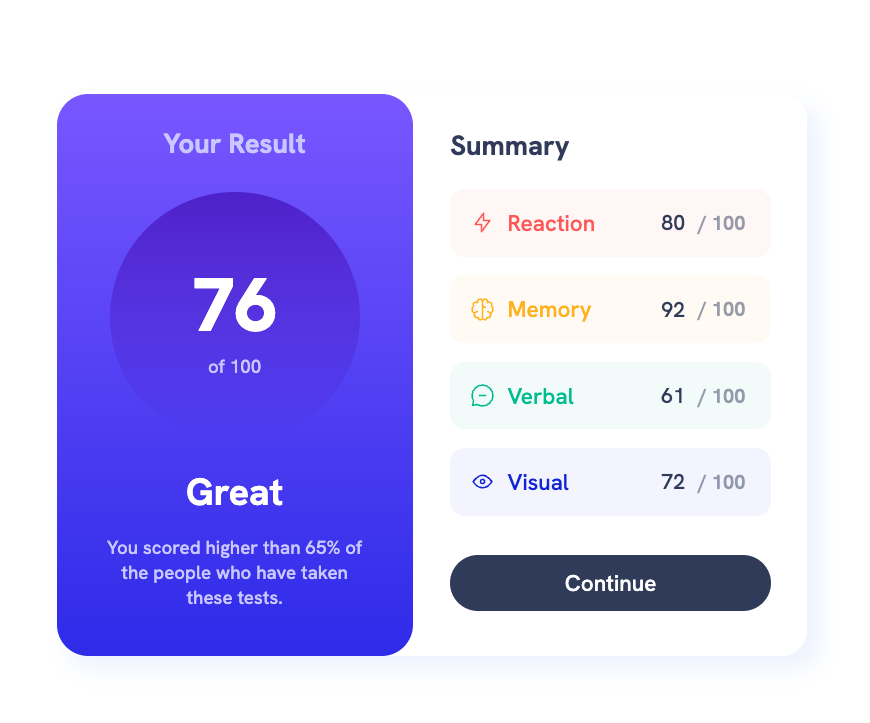

# Frontend Mentor - Results summary component solution

This is a solution to the [Results summary component challenge on Frontend Mentor](https://www.frontendmentor.io/challenges/results-summary-component-CE_K6s0maV). Frontend Mentor challenges help you improve your coding skills by building realistic projects. 

## Table of contents

- [Overview](#overview)
  - [The challenge](#the-challenge)
  - [Screenshot](#screenshot)
  - [Links](#links)
- [My process](#my-process)
  - [Built with](#built-with)
  - [What I learned](#what-i-learned)
  - [Continued development](#continued-development)
- [Author](#author)

## Overview - expected outcome


### The challenge
Your task is to build out the project to the designs inside the `/design` folder. You will find both a mobile and a desktop version of the design. All required assets for the project are provided and optimized for correct screen size.

Variable and static font files for the required fonts for this project are provided as well. There is also a `style-guide.md` file containing the information you'll need, such as color palette and fonts.

Users should be able to:

- View the optimal layout for the interface depending on their device's screen size
- See hover and focus states for all interactive elements on the page
- **Bonus**: Use the local JSON data to dynamically populate the content (JSON file provides the information)

### Screenshot



### Links

- Solution URL: [Add solution URL here](https://your-solution-url.com)
- Live Site URL: [Add live site URL here](https://your-live-site-url.com)

## My process

### Built with

- Semantic HTML5 markup
- CSS custom properties
- Flex-box
- [React](https://reactjs.org/) - JS library
- [Next.js](https://nextjs.org/) - React framework
- [Styled Components](https://styled-components.com/) - For styles


### What I learned

Use this section to recap over some of your major learnings while working through this project. Writing these out and providing code samples of areas you want to highlight is a great way to reinforce your own knowledge.

* CSS screen media controls to dynamically change component layout
  ```css 
  @media only screen and (max-width: 450px) {
      .container {
          flex-direction: column;
          height: 100vh;
          width: 100%;
          align-items: center;
          min-width: 260;
      }}
  ```

* Practice with CSS Flex-box:
```css
  .summary-card ul li {
    flex-grow: 1;
    display: flex;
    flex-direction: row;
    align-items: center;
    justify-content: space-evenly;
  }
  ```


```html
<h1>Some HTML code I'm proud of</h1>
```
```css
.proud-of-this-css {
  color: papayawhip;
}
```
```js
const proudOfThisFunc = () => {
  console.log('🎉')
}
```

### Continued development

- Scaling styles and better responsiveness
- Typography matching the design accurately
- Dynamically populate the content with JSON data

## Author
Zedrichu - Adrian Zvizdenco

**Have fun building!** 🚀
